# SaleWeb
Página de gestión de ventas online.

### DESCRIPCIÓN ###

La página web implementa un servicio de venta on-line y tiene la funcionalidad de proporcionar a los usuarios una navegación por los artículos de la página, permitir seleccionar los que quieren comprar, acumulandolos en un carrito de compra y posteriormente confirmar el pedido, eliminando esos artículos del stock de la tienda. Para todo ello sera necesario tener una cuenta con los datos de cada cliente. Hemos dividido la pagina en dos partes:

- **Parte Pública**: Los usuarios podran registrarse en la tienda on-line, navegar por la lista de artículos viendo los detalles de cada uno y comentarios que otros usuarios han dejado, pudiendo el propio usuario dejar un comentario; tambien podrán añadir artículos al carrito para proceder posteriormente a la confirmación y compra del pedido.

- **Parte Privada**: En este caso solo unos usuarios concretos con permisos de administrador podran acceder. Las funcionalidades que tienen son la de añadir, modificar y/o retirar artículos del stock de la tienda, asi como escribir comentarios en los artículos, pudiendo tambien modificar y/o eliminar comentarios que haya escrito cualquier otro usuario.
 
### ENTIDADES PRINCIPALES ###

- **Articulos**: Son los diferentes productos disponibles de la pagina que los usuarios pueden comprar.
- **Pedidos**: Es el apartado donde cada usuario pueden consultar el historial de pedidos realizados anteriormente, descargarse las facturas, etc...
- **Usuarios**: Es cada una de las personas registradas en la pagina.
- **Comentarios**: Es un apartado en el cual cada uno de los usuarios puede opinar o aconsejar a otros usuarios basandose en su propia experiencia de compra en dicha plataforma.
- **Carrito**: Es un pedido provisional donde cada usuario puede añadir, modificar y eliminar cualquier producto que posteriormente quiere pagar.

### SERVICIO INTERNO ###

Nuestra aplicación web usa un servicio interno que lleva a cabo la confirmación de la compra de un usuario mediante el envio de un correo electrónico.
La dirección del destinatario donde se manda el e-mail de confirmación sera la que se especifica el usuario que realiza la compra en su registro.
A su vez, en el correo electronico se especificará la dirección de correo electrónico de la tienda on-line (salewebdad@gmail.com).

### MODELO UML, MODELO ENTIDAD/RELACION (E/R), DIAGRAMA DE NAVEGACION Y DESCRIPCION DE VISTAS ###

A continuación mostramos el modelo UML, el modelo entidad/relacion, el diagrama de navegación de la aplicación y cada una de las vistas con su correspondiente descripción:

**Diagrama UML**

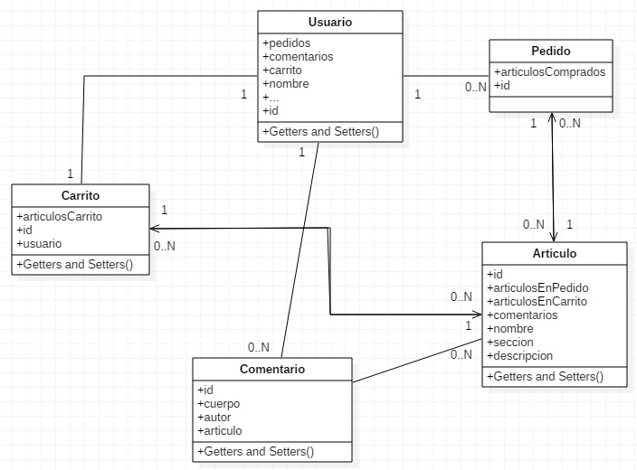

**Diagrama Entidad/Relacion**

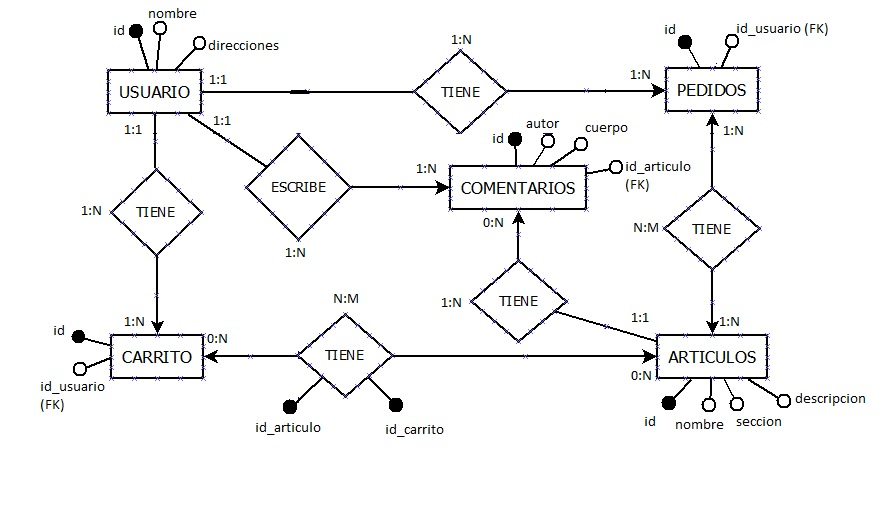

**Diagrama de navegacion**

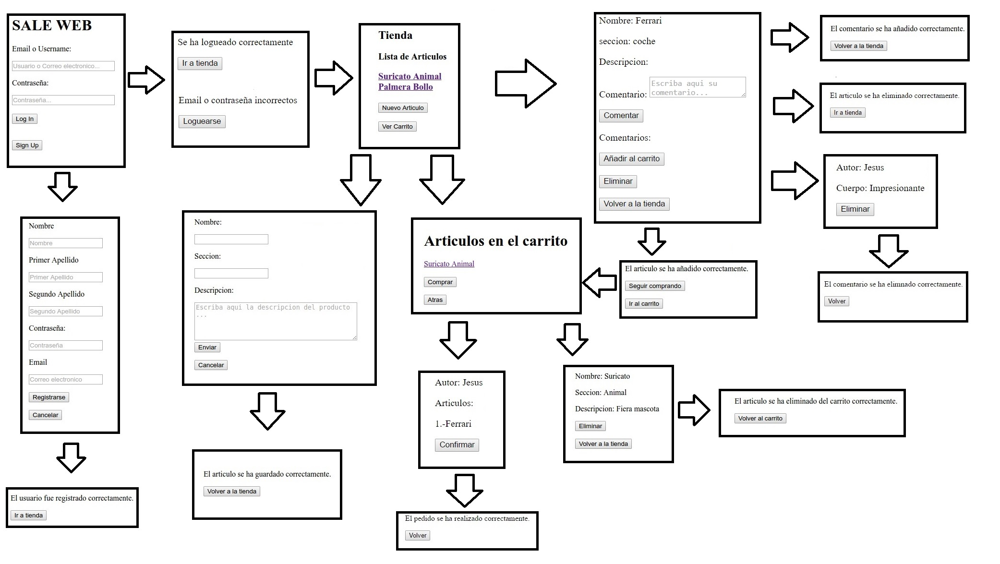

**articulo_añadido.html**

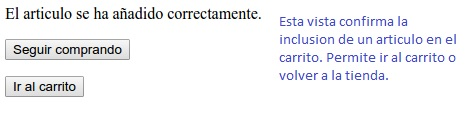

**articulo_eliminado.html**

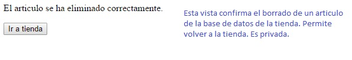

**articulo_guardado.hmtl**

**articuloCarritoEliminado.html**

**carrito.html**

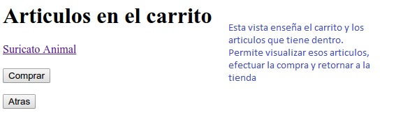

**comentario_eliminado.html**

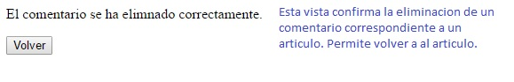

**comentario_guardado.html**

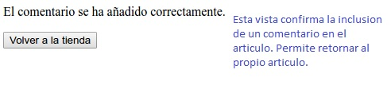

**loggin_usuario.html**

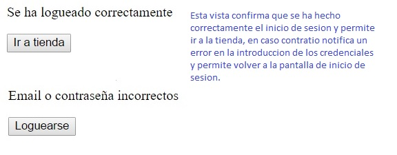

**nuevoArticulo.html**

**nuevoUsuario.html**

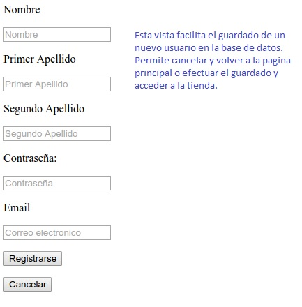

**pedido.html**

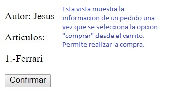

**pedido_realizado.html**

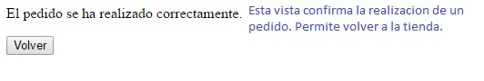

**principal.html**

**tienda.html**

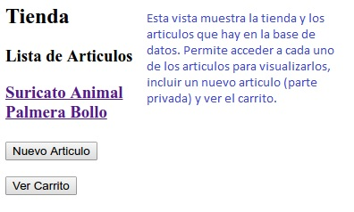

**usuario_registrado.html**

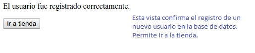

**ver_articulo.html**

**ver_articuloCarrito.html**

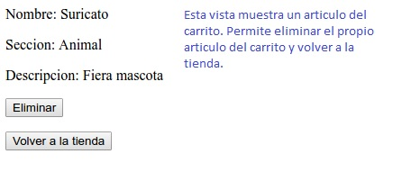

**ver_comentario.html**
	

### INSTRUCCION PARA DESPLEGAR LA APLICACION EN AZURE ###

1) 	Generar un certificado pem para acceder a la máquina virtual:

		`openssl req -x509 -nodes -days 365 -newkey rsa:2048 -keyout azureus.key -out azureus-cert.pem`
		
2) Proteger la clave privada:

		`chmod 0600 azureus.key`
		
3) Crear una maquina virtual en Azure eligiendo una imagen de Ubuntu Server 14.04 y usando el certificado creado en el paso 1.

4) Acceder a la maquina virtual con un cliente ssh, usando la clave privada creada en el paso 1 y la ip publica de la maquina virtual:

		`ssh /path/to/azureus.key azureuser@<ip publica>`

5) Una vez dentro de la maquina virtual, instalar OpenJDK 8 JRE con los siguientes comandos:

		
		sudo add-apt-repository ppa:openjdk-r/ppa
		sudo apt-get update
		sudo apt-get install openjdk-8-jre
		
6) Instalar MySQL:

		sudo apt-get update
		sudo apt-get install -y mysql -server
		
7) Crear la base de datos:
		
		$ mysql -u root -p;
		mysql> create database <bbdd>;
		mysql> create user `<usuario>´@´%´ identified by `<bbdd>´;
		mysql> grant all privileges on <bbdd>.* to `usuario´@´%´;
		mysql> flush privileges;
		mysql> exit;

8) Crear el ejecutable de nuestra aplicacion, haciendo Run as > Maven Install en el STS.

9) Subir el ejecutable desde nuestro equipo a la maquina virtual:

		`scp -i /path/to/azureus.key aplicacion.jar azureuser@<ip publica>:/home/azureuser/`

10) Acceder a la maquina virtual como ya hemos visto en el paso 4:
	
11) Ejecutar la aplicacion desde la maquina virtual:

		`java -jar aplicacion.jar`
		

### INTEGRANTES DEL GRUPO ###

1. César Cuesta Vera: c.cuestav@alumnos.urjc.es
2. Jesús Rosa Martín: j.rosa@alumnos.urjc.es
3. Alvaro Gala Martinez: a.gala@alumnos.urjc.es
